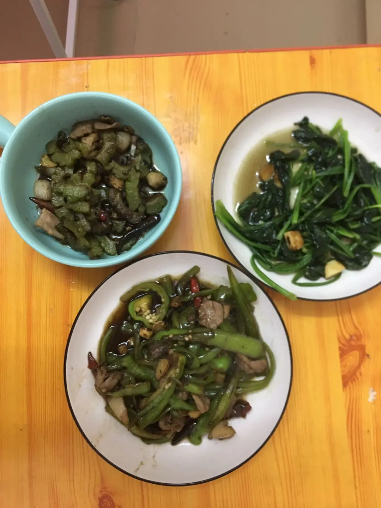
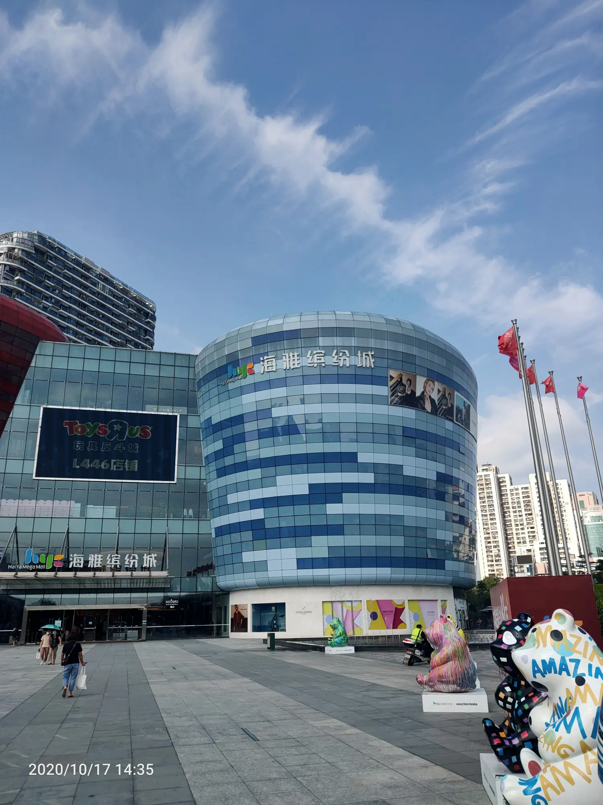
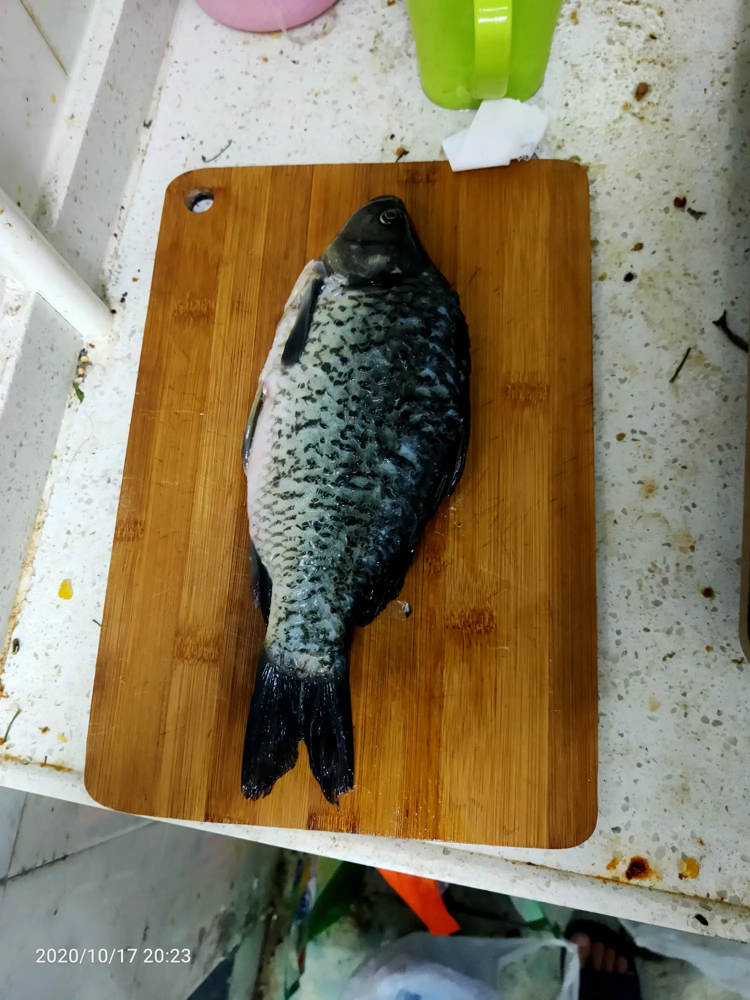
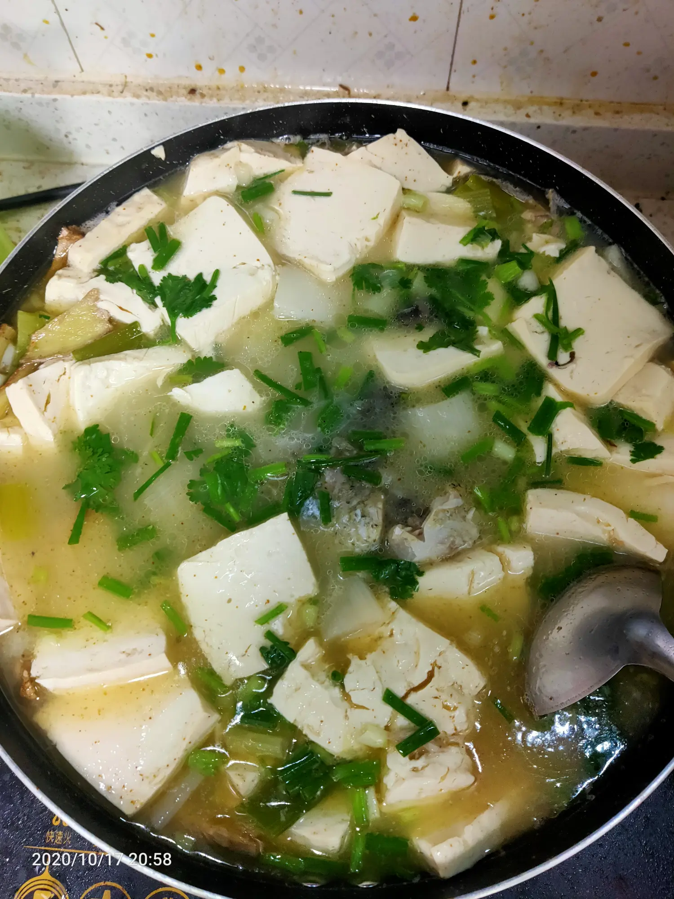

《山月记》:"我深怕自己本非美玉，故而不敢加以刻苦琢磨，却又半信自己是块美玉，故又不肯庸庸碌碌，与瓦砾为伍。于是我渐渐地脱离凡尘，疏远世人，结果便是一任愤懑与羞恨日益助长内心那怯弱的自尊心。"
中午治超问我吃饭没，然后顺路去他那儿吃了个

实在不好吃，于是我在他那儿又炒了个番茄鸡蛋

今天下午逛了一下午

试了三件特别好看的衣服就是有点贵

这个本来是看鞋的620，但貌似太孩子气了点

这个600多，就是有点厚

399  以后买一件

晚上她回来想着做个汤
叮咚买菜12块一条鲫鱼，又买了两块豆腐

夸了我半天，做了一大锅
