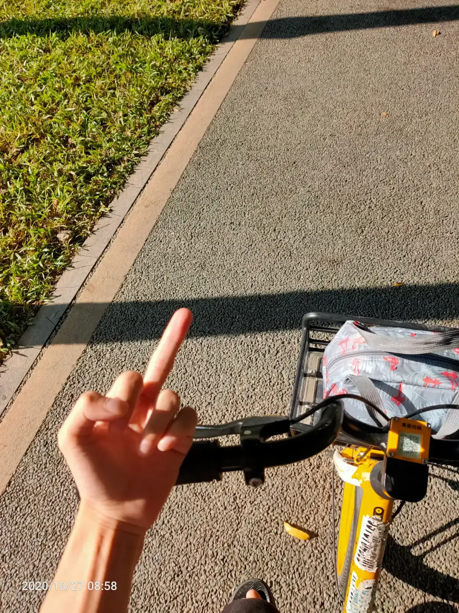
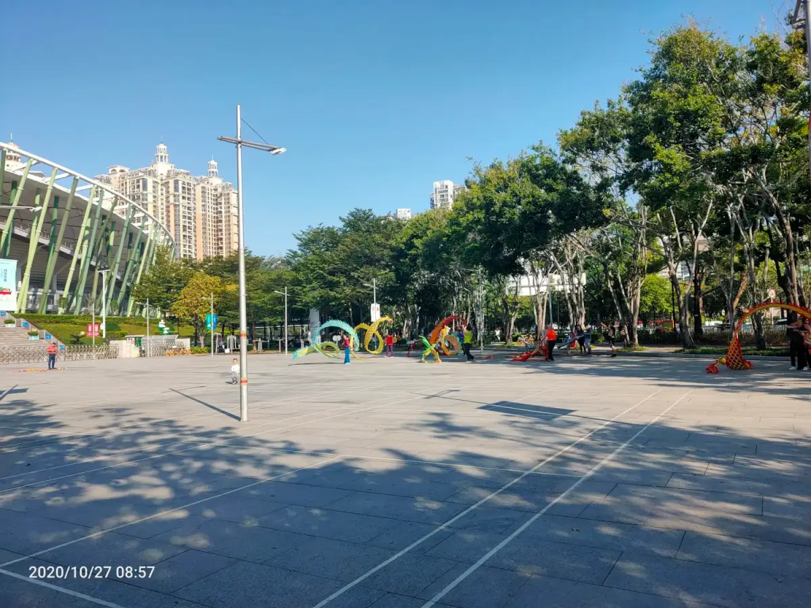

早上6点半米饭蒸熟，翻个身问狗你起来吗，不出声，继续睡
早上7点半起床，洗头，炒菜
8点，吃早饭
8点40出门找摩拜
9点到地铁站
9点20，地铁打卡
9点半到公司，刷新闻到10点
12点吃午饭
13点40睡醒，玩会儿手机
14点工作
18点晚饭不吃了，玩手机
19点工作看书到21点
21点30到操场
22点到家吃晚饭
23点睡觉高压锅米饭蒸上定时7个小时

一天天平平淡淡过去

加油打工人,奥利给

为了这些房东大妈大爷更美好的明天而战

