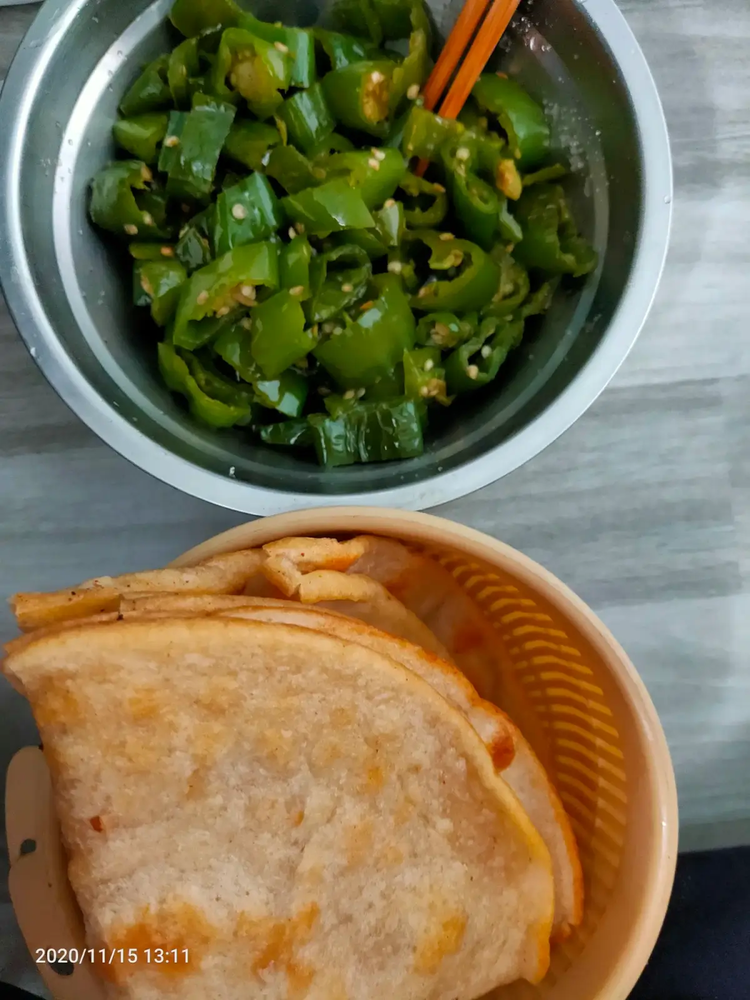

今天它下班有抓着空挡生气
1*怨我催它说好走，结果拖了20分，倒杯水。
2*走在路上问多少钱，心平气和说，她却急了，怨我说不清楚，

今天在想如果当初她问我以前说的算不算，我估计现在回去，我可能会犹豫吧，也不会像当初那么开心，毕竟它的缺点太多了，当初想的太完美

都是成年人，表现得弱的跟个小朋友，慢吞吞，一身赘肉，还不能我嫌弃，可能我眼光高吧

我想的两个人相处应该是互相包容，互相变优秀。而不是一味的让我来迁就它，

辣椒很辣，炒熟闷一下就更辣

往下再看看吧
