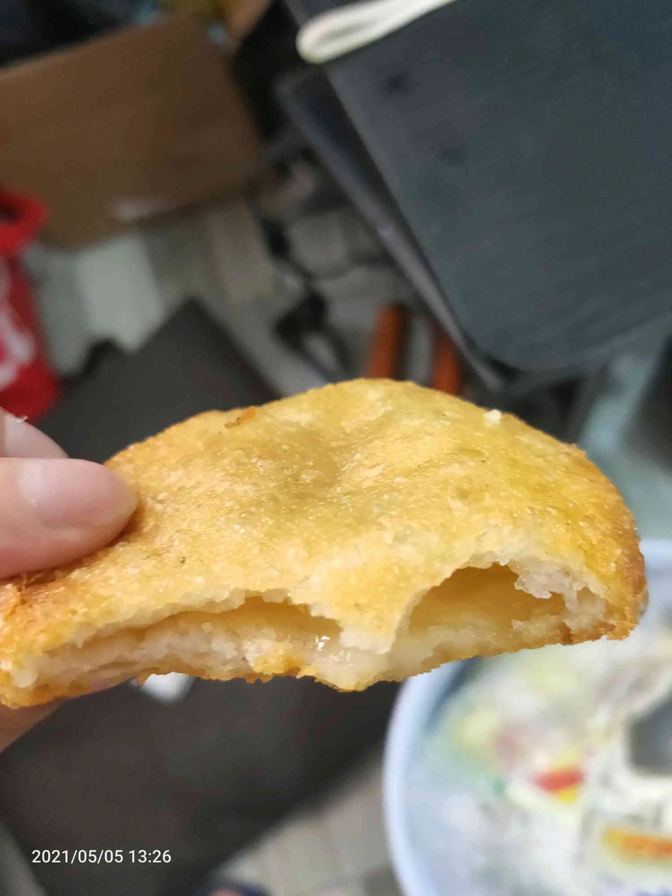
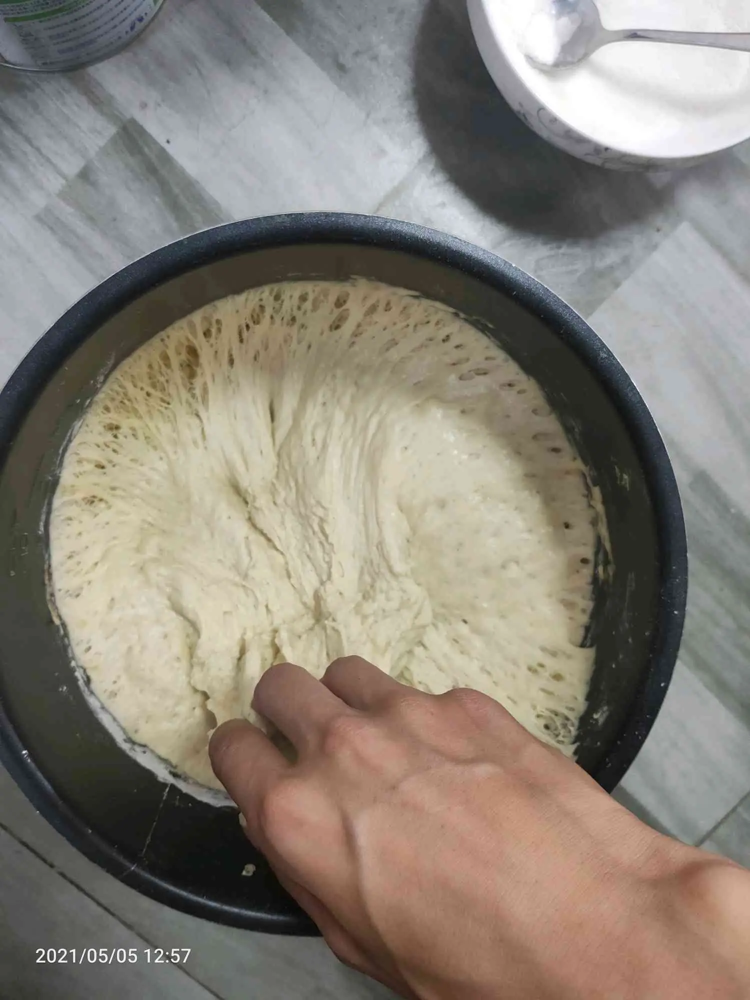
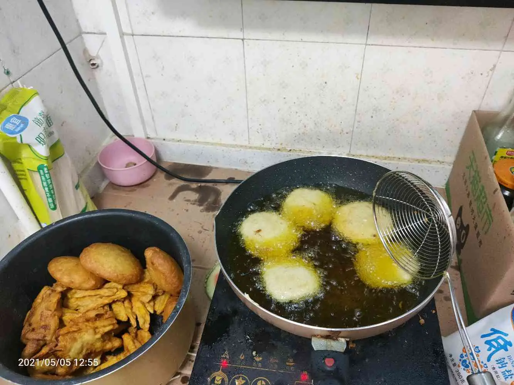
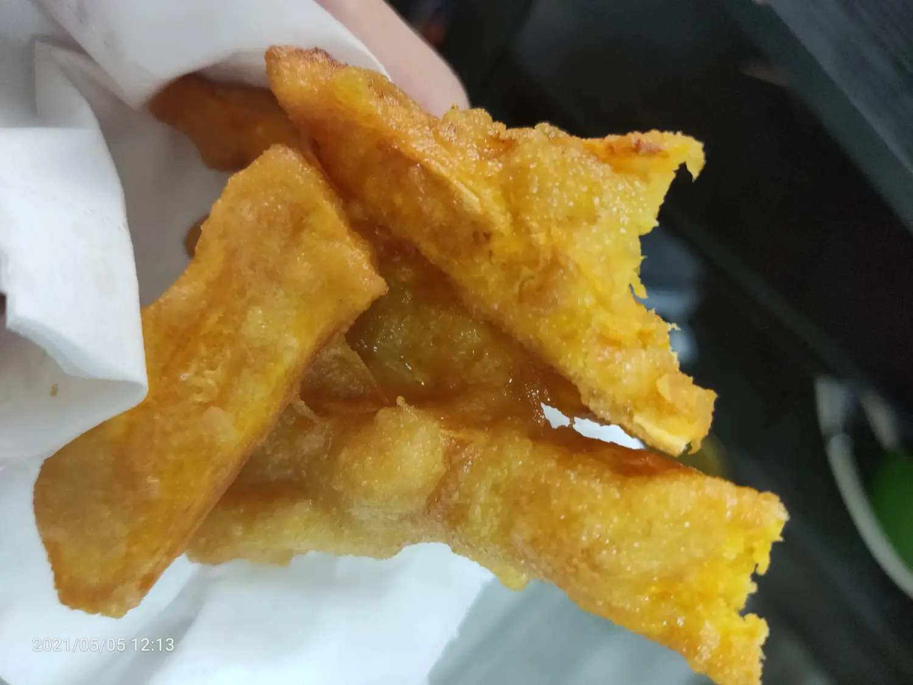

今天是五一的最后一天，我要做点有意义的事情，头天晚上就想好了

炸糖糕，炸油条

早上起床，8点多出门去超市，买了红薯，买了西瓜，回来把西瓜吃了，红薯切了。等了好久京东买的面没到，于是我就下楼买了酵母，家里的酵母生虫了。买了白糖

回来把油条的面做上，一斤面，适量温水，5g酵母，和好后放在温热地方发酵
烧了热水烫面，烫好，加入油和干面粉，面加白糖做馅，

倒油， 炸红薯条， 炸糖糕， 由于面不够只能乱炸不成型的油条， 成色还是不错饿的。发在家里群里，妈妈和婶婶都夸我，真的很像家里的那种感觉

晚上下班，范最近要面试教师资格证，一起去买个衣服，结果逛了好久的六福和周生生。

回去晚了，吃了碗螺蛳粉，很是好吃
