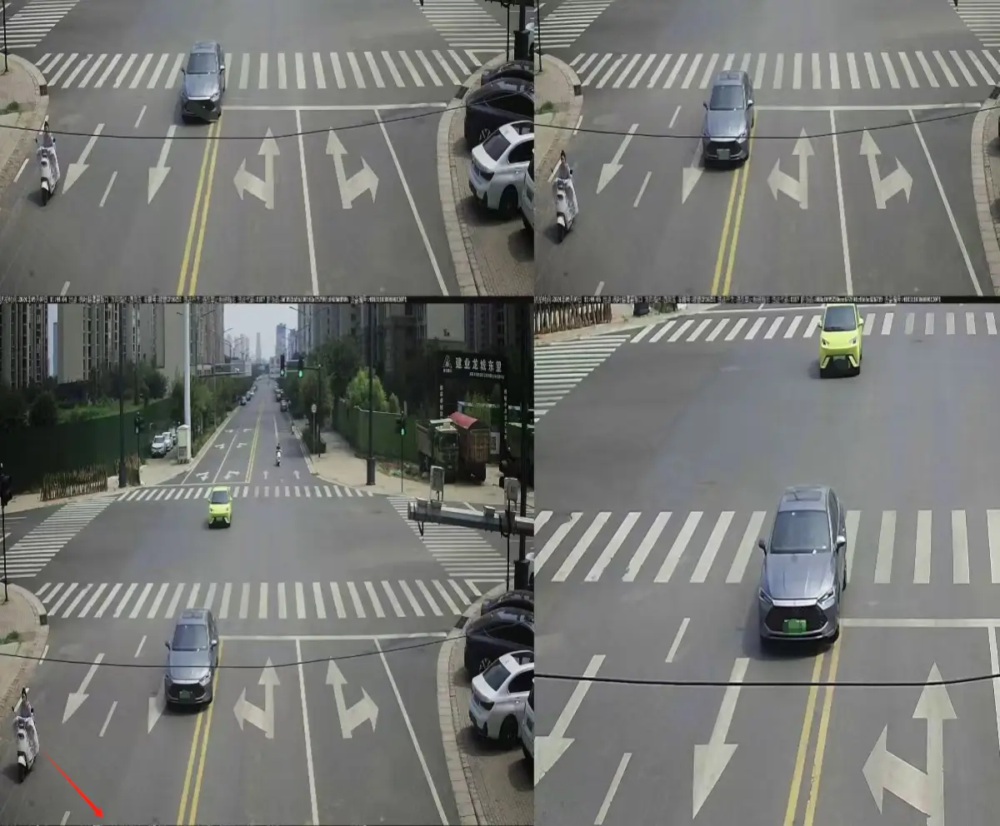

说来也是巧，我刚想下载12306报名考个摩托D照， 下载后发现河南线上不能报名必须要到当地交管局。  
  
看到App有个违法未处理，一看喝。1个月前的电子眼违章， 当时好像是我外婆过生日，看到是十字路口压线， 因为那边  
是刚发展的地方，当地的人都不会特别遵守交通规则，粮食晒在路上的不少，而且并排电动车走在机动车道上，说拐就拐  
  
每次看到都躲得远一点，谁知道哎  
  
申诉了，然后看不到处理结果  
  
  
  
只能抱怨地方真是太缺钱了  
  
之前刚买车， 停在那边，荒野地，被纱布城管贴了，没管最后还追加罚款，450元， 就当烧给够了  
  
果然在我天朝，权利大于一切， 钱就是这么折磨底层套牢来的， 到处都是压迫  
  
没有一点人性化执法的可能， 难怪都要考公呢，都想当老爷  
  
