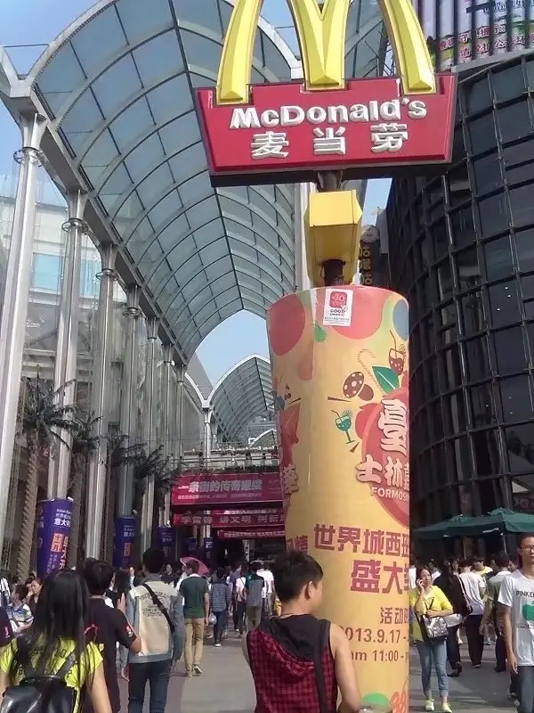
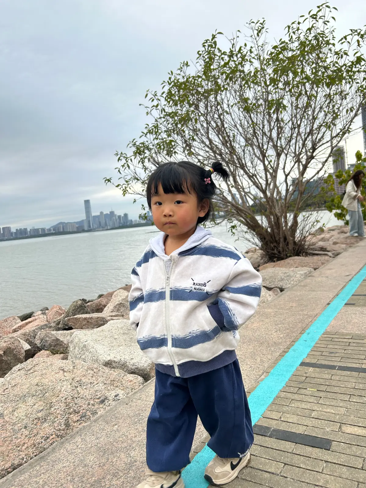

# 一. 旅行总计
1. 耗时：五天1.29 出发  2. 3 返程  5天
2. 花费(5456)
    【火车票】去 1024  中 136  回 1194 共计：2354
    【吃喝玩】  606
    【住】  453
    【购物】  1862
    【地铁打的】  181

# 二. 旅程列表

## 第一天 1.29 (出发)
今天是大年初一，孩子起来时候已经是十点多了，村里祠堂发红包，孩子也没赶上。起床带着孩子去爷爷家拜年，下午一点半准时从家出发到达高铁站

到了郑州站，直达的车晚点58分钟，找了家德克士吃饭。

上了火车硬座太挤，而且要4个多小时，立马找乘务员补了卧铺，结果要从18车厢走到3车厢，漫长的走过层层车厢。

到武汉时已是晚上九点半，住在车站附近，打的去到了长江大桥，从桥上走到桥下，走到了户部巷，桥上给孩子买了个花环和小手枪（武昌起义第一枪）

逛完拍照已过凌晨，速回酒店

## 第二天 1.30 (武汉-辛亥革命-武汉大学)
晨起还是如昨日，出门已是10:30,  找饭店吃饭，由于是过年开店的已是少数，第一家饭店啥都没。还涨价一块，走过了几家，只有面，他们回头吃第一家涨价就涨价，老板还爱理不理，我直接去吃面了5快钱

步行到辛亥革命纪念馆，拍照打卡，这里我第一次来还是2013.10.4 号，过了这么多年了，这次是带着孩子来这里

逛完直达武汉大学，逛了门头，逛了旧宿舍楼，结果孩子的小手枪丢了，

此时16:00 ， 晚上19:30 的火车，时间还够，直达市中心，光谷步行街，这个地方我大学是经常来这边玩，可谓是轻车熟路，但是上次来这里已经是18年，到现在已经过去快7年了。 那时候坐地铁还要经过天桥，现在直接地铁口直达光谷广场正门口

去楼上没多少家开门，下楼拍了黄金楼，去西班牙风情街拍了斗牛，大教堂还在，只不过门头已变成huawei。

武汉之行结束，火车两个中铺（老婆怕孩子丢特意嘱咐的，结果孩子站不起来，难受一晚上）武汉过年饭菜涨价，面筋10元4串，在不告知的情况下只给了3串，坑人

## 第三天 1.31 (深圳-欢乐港湾-红树林)
经过一晚上的行程，早上7:30 到达了深圳，坐火车到达以前住的小区附近的酒店，曾经的回忆涌了上来。昨晚没睡好再睡一会儿
出门时候已是12:30, 前往欢乐港湾。

孩子看到滑梯非要玩个不停，我们想去下个地方逛，哄了好久才哄走了，打车到红树林这里。
一路步行，从后海这边一路走到深圳湾地铁站。 以前在后海上班，晚上吃完饭最喜欢从A8音乐大厦走着去红树湾逛逛，晚上回去路上非常非常累一天走了13km

## 第四天 2.1 (深圳-大梅沙)
由于今天要去大梅沙，在深圳的最东边，而且明天要去香港，住在福田最为方便，可能未来不会在来这边了

这条天桥我走了很多很多次，这次是和孩子一同走过

坐了一个小时到达住宿的地方，放好东西，启程8号线前往大梅沙
刚下站孩子超级兴奋奔向了沙滩，这是孩子第一次看到大海，

和孩子要合拍星爷在海边大喊努力奋斗的口号，孩子要站在小桶上一不小心结果挂彩了，用口罩包扎不能下海了

回程去华强北吃了汉堡，孩子吃了冰淇淋， 结果到下面哭着非要喝橙汁

给孩子在银匠世家买了手镯，孩子卷起袖子不忍放下

## 第五天 2.2 (香港)
老婆的港澳通行证签注一直没能签注成，只能我独自带孩子去
高铁福田到西九龙，下车立马办理33港币的mysim
孩子吃糖不打扰，
步行到达重庆大厦，万宁买药结束后，直奔维多利亚港
维多利亚港和李小龙合影拍照

期间可乐雪糕不断，
天星码头坐船到达中环，孩子坐船前看到旋转盲盒，20港币的玩具，结果船上就丢了

中环坐地铁到达铜锣湾时代广场孩纸睡着了

香港的车感觉特别好看迷你，
一个小时后去楼上买log相机回家

走路到1.3公里到鸿兴玩具买了雪糕车，坐在路边补充能量，街边有跳舞的以前以为是自由开放，后来才知道他们都是菲佣，孩纸高兴的和他们共舞
，他们邀请孩子一起跳好热情啊

购物一天的收获，消费1800

## 第六天 2.3 (深圳-华强北)
深圳的最后一天，晚上就要返程了，今天休息一整天，范说要来逛华强北，买个剃须刀，我想给手机扩容，最后什么都没弄成，倒是给孩子买了个小玩具，孩子非常喜欢，玩了一路

