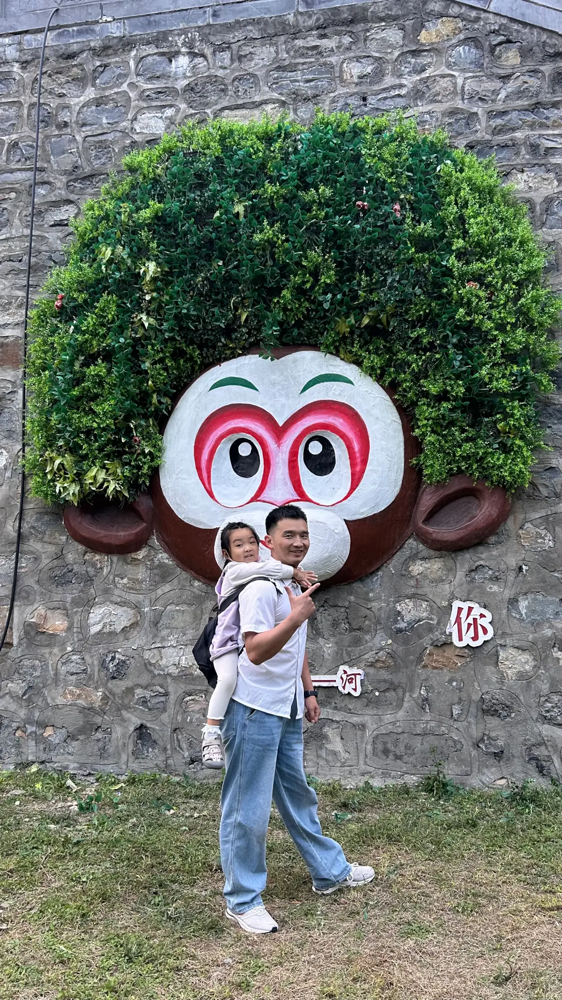
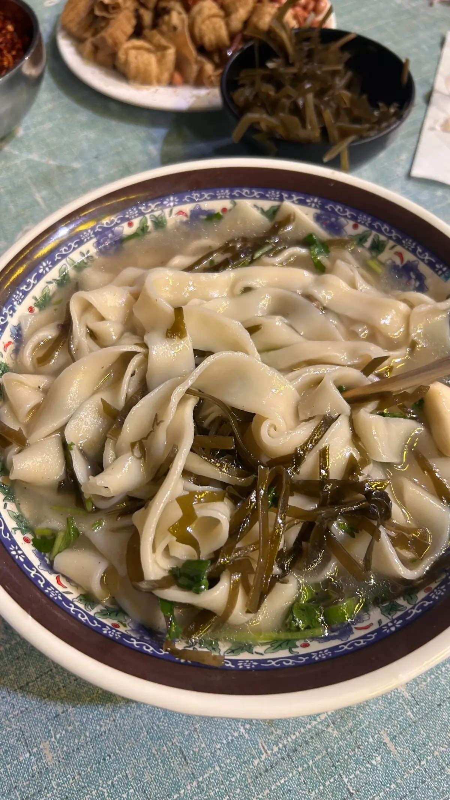
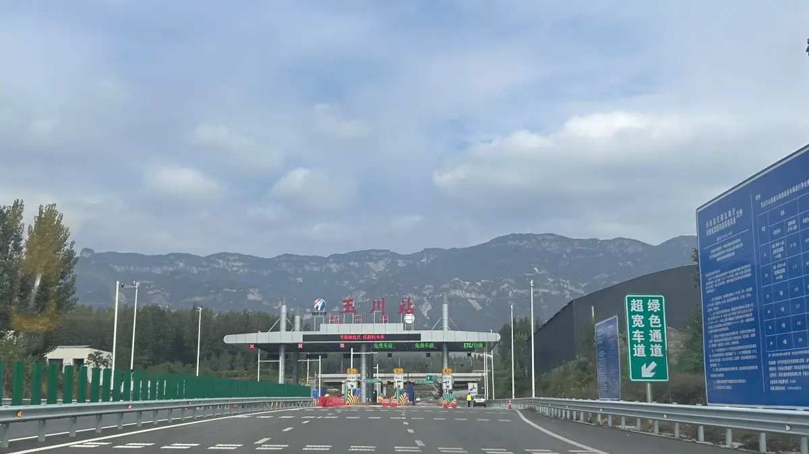
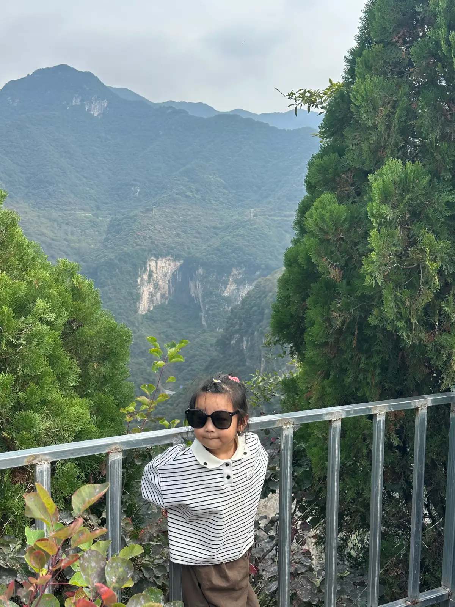
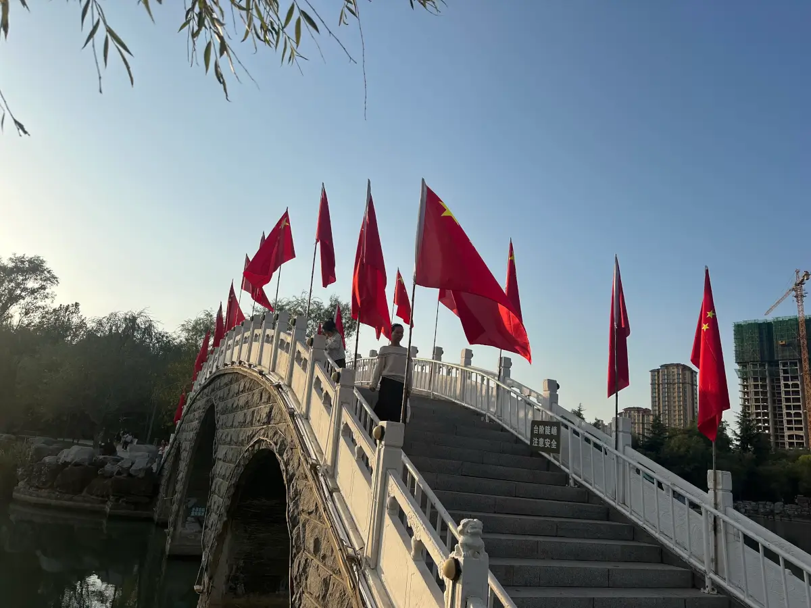
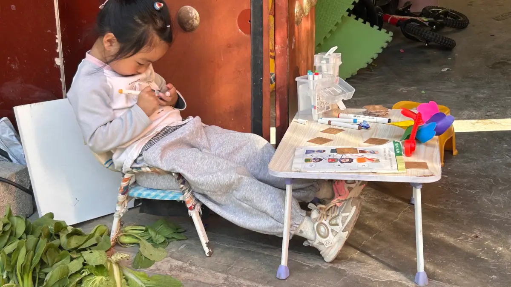
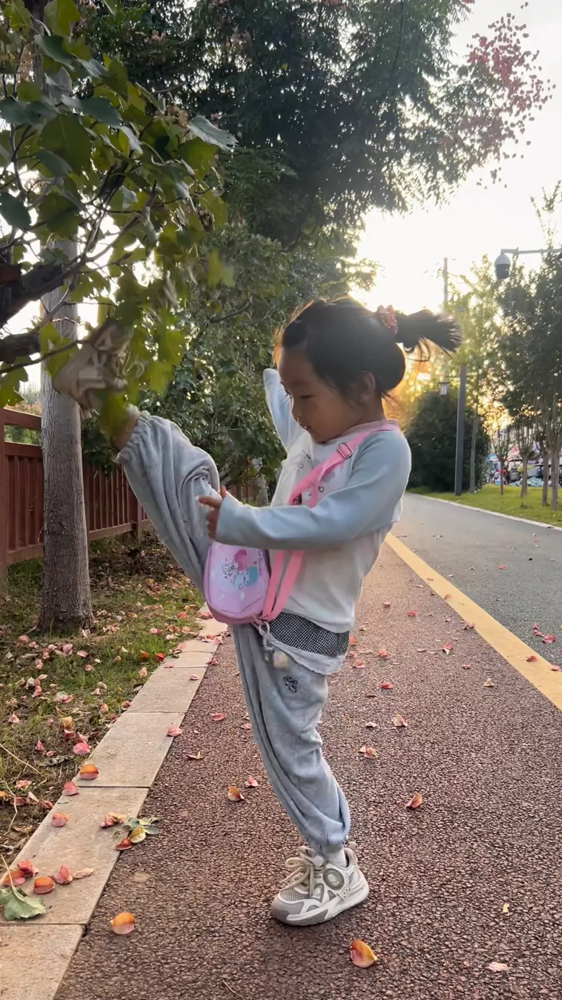

10.1  今天同学喊我带着孩子去游乐场玩，孩子最喜欢玩的就是格子游戏，这次没玩到之前的 vr 排队时间太久了。 玩了高空闯关游戏，胆子真大ya。

  <video src="https://pub-4232cd0528364004a537285f400807bf.r2.dev/2026/c8f58d97-1e8f-42a5-a881-d66b3e5c528b.mov" controls controlsList="nodownload" preload="metadata" class="responsive-video">
    您的浏览器不支持视频播放
  </video>

晚上去钓鱼.

10.2 范同学满月宴，我们一起济源。下午去济源的五龙口猴山逛了逛，猴山的猴子都是放养的，需要人手拿着棍子，我想着拿着棍子踩着走，结果直接两根断了，尴尬。回来孩子就走不动了，书包派上大用途了，背着走。

晚上他们决定在济源住一晚，第二天再 去晋城
吃了一份超好吃的烩面

晚上他们住酒店，我去车上睡，晚上下雨了，只能 50 找了个睡觉的地方

10.3 今天出发去晋城，早上吃了蕊带的不翻鸡蛋，然后路上决定沿那里去晋城，纠结了有一会儿，决定沿太行公路一号线

幸亏做了这个，路口拐进了观景台

  <video src="https://pub-4232cd0528364004a537285f400807bf.r2.dev/2026/6e57047e-ff63-4574-a230-05a46eff8740.mov" controls controlsList="nodownload" preload="metadata" class="responsive-video">
    您的浏览器不支持视频播放
  </video>

下午赶到晋城已经快 3 点了，没有吃的，晋城不大，随便找了路边吃了面，去公园逛了会儿打道回府

10.4  今天去健身房锻炼，晚上去钓鱼，钓了好多，没吃全放了得了

10.5 今天给兰汐在家制作写字卡，孩子在门口涂颜色

去路上吃擀面皮，赶会，孩子带着自己的钱买东西
路边绿道蹦跳，晚上去奥体跑步
