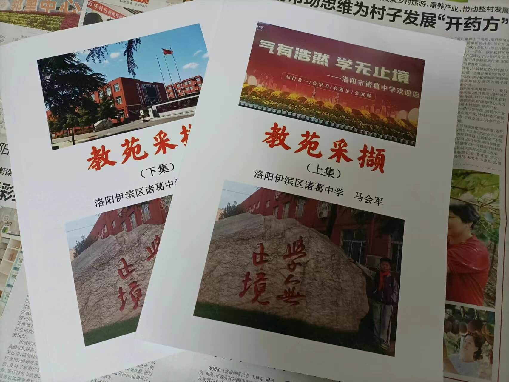
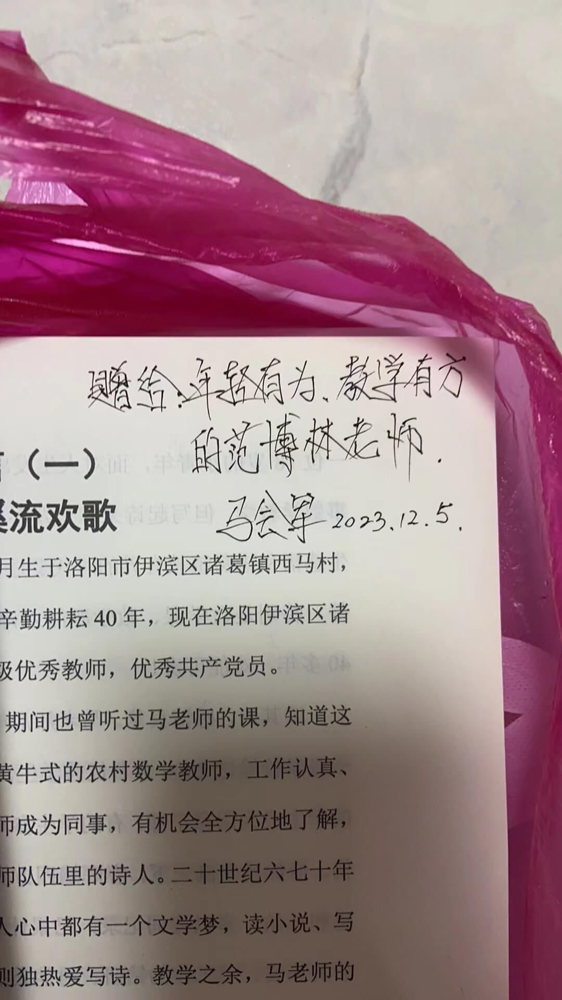

今天范给我发了一条消息说是我初中数学老师并且是我们村的(马会军) 他给她一本书，相当于自己教学的回忆录。  
范以前并不认识我这位老师，后来是因为招教面试去找了我这位老师，参考了很多东西， 后来就一来二往就熟了点。   
我这位老师，教学方法我现在都记得，我数学的良好习惯都是他激发的。 错题让我们自己上去讲，而且我这位老师记录简书已经非常多条，每天都在写日记。范总结就是：晨起五点， 呼赫读书， 出去锻炼，种地至11点。下午诸葛里教课。  
  
  
