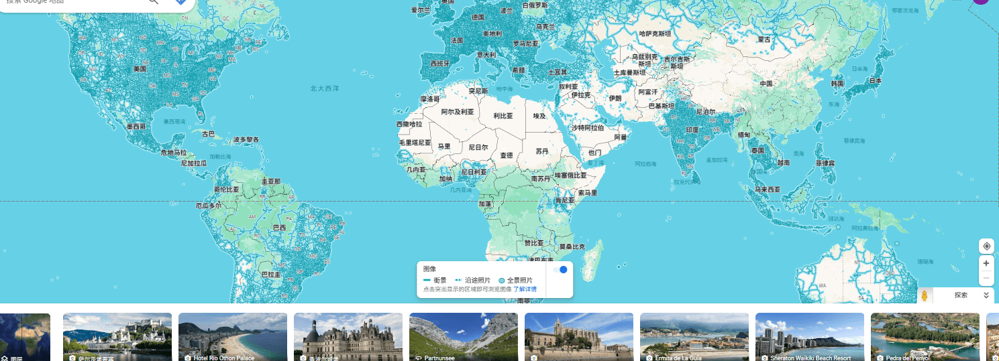

1. 街景地图是在地图上展示360照片，能在地图上身临其境，地图上云游。

已知国内为的街景地图支持商有两家谷歌和百度

[谷歌地图](https://www.google.com/maps) 点击右下角小人就能查看世界各地的街景（不包括国内）

同时支持第三方上传  [谷歌街景上传](https://www.google.com/streetview/contribute/)

[百度地图全景上传](https://quanjing.baidu.com/)  百度的要求就有点高了，要注册上传身份信息等

地图街景设备类

我们没有专业的设备可以使用GOproMax  鱼上 1500 onex3  2000 左右

[17年软件园上班](https://map.baidu.com/@12736572.209999999,3543470.76,21z,87t,88.77h#panoid=0900020012220930095710063AK&panotype=street&heading=356.92&pitch=1.61&l=21&tn=B_NORMAL_MAP&sc=0&newmap=1&shareurl=1&pid=0900020012220930095710063AK)

百度地图上看到曾经住的[小区](https://map.baidu.com/@12678456.95,2563995.37,21z,87t,135.57h#panoid=0900570012210312152944509GH&panotype=street&heading=319.19&pitch=-17.46&l=21&tn=B_NORMAL_MAP&sc=0&newmap=1&shareurl=1&pid=0900570012210312152944509GH)

[曾经上班的地方](https://map.baidu.com/@12678719.14,2562422.46,21z,87t,-74.78h#panoid=0900570012210311150146561GH&panotype=street&heading=159.81&pitch=-1.45&l=21&tn=B_NORMAL_MAP&sc=0&newmap=1&shareurl=1&pid=0900570012210311150146561GH)

[家里](https://map.baidu.com/@12525931.08,4085358.94,21z,87t,-46.74h#panoid=09027800001407251410284486E&panotype=street&heading=134.17&pitch=-17.35&l=21&tn=B_NORMAL_MAP&sc=0&newmap=1&shareurl=1&pid=09027800001407251410284486E)
