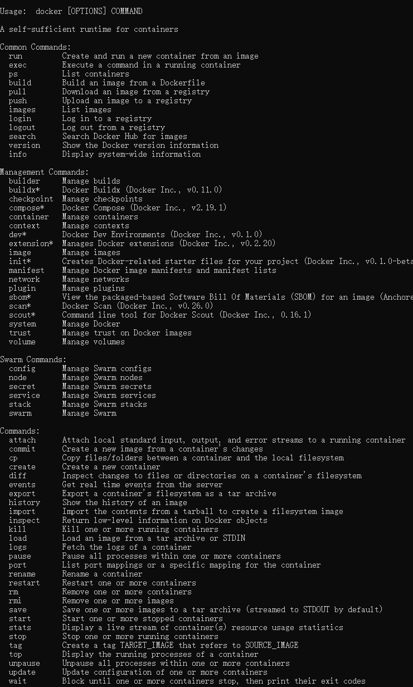

# 一. Docker
## 1. 为什么需要Docker
背景：软件开发最大的麻烦事之一，就是环境配置。 用户必须保证两件事：操作系统的设置，各种库和组件的安装。只有它们都正确，软件才能运行。举例来说，安装一个 Python 应用，计算机必须有 Python 引擎，还必须有各种依赖，可能还要配置环境变量，环境配置如此麻烦，换一台机器，就要重来一次，引出了虚拟机，但是缺点很多，资源占用多，启动慢。 能不能有一个工具，让开发人员在任意环境下，都能安装软件，运行软件，而不需要考虑环境问题呢？

解决方法：Docker。


## 2. Docker 是什么？
Docker 是一个容器引擎，它允许你将你的应用程序封装到一个容器中，然后在任何地方运行。

基本概念：
- 容器化：Docker 利用了 Linux 内核的命名空间（Namespaces）、控制组（Control Groups, Cgroups）和联合文件系统（Union File System）等技术来实现容器的隔离和资源限制。•命名空间提供进程、网络、文件系统、用户ID、挂载点等层面的隔离，使得每个容器看起来就像拥有独立的系统资源。•控制组用来限制和审计各个容器对系统资源（如CPU、内存、磁盘IO、网络带宽等）的使用
- 镜像：Docker 镜像就是一个包含应用程序和其依赖的文件系统，可以被共享和重用。类似于java 中的class文件
- 容器：容器是运行时的一个实例，包含镜像中的文件系统和进程。类似于java中new的对象

## 3. 如何安装Docker

CentOS： `sudo yum install docker-ce docker-ce-cli containerd.io docker-compose-plugin`  


Windows: `下载 Docker Desktop Installer.exe`

previewpreviewpreview
## 4. Docker 的使用
看看docker 指令~~~~  


```shell
docker run -d --name my_nginx -p 80:80 -v D:\docker\nginx\conf.d:/etc/nginx/conf.d -v D:\docker\nginx\nginx.conf:/etc/nginx/nginx.conf -v D:\docker\nginx\html:/usr/share/nginx/html -v D:\docker\nginx\log:/var/log/nginx  nginx:latest
```
```shell
1. docker run 从镜像启动容器
     -d 后[index.html](..%2F..%2F..%2F..%2F..%2Fdocker%2Fnginx%2Fhtml%2Findex.html)台运行
     -p 80:80 指定端口
     --name nginx 指定容器名
     -v <host path>:<container path> 指定挂载目录
     nginx 指定镜像
     -it /bin/bash 进入容器

2. docker ps 查看运行中的容器  -a 查看所有容器
3. docker exec -it <container id> /bin/bash 进入容器  -d 后台运行指令
4. docker images 查看镜像
5. docker search <image name> 搜索镜像
6. docker pull <image name> 拉取镜像
7. docker build -t <image name> . 从Dockerfile构建镜像

容器管理命令

1. docker stop <container id> 停止容器
2. dockker start <container id> 启动容器
3. docker restart <container id> 重启容器
4. docker rm <container id> 删除容器
5. docker kill <container id> 强制停止容器

镜像管理命令
1. docker commit <container id> <image name> 从容器中创建镜像
2. docker tag <image id> <image name> 为镜像打标签
3. docker rmi <image id> 删除镜像
4. docker push <image name> 推送镜像到仓库
5. docker export <container id> <path> 导出容器为镜像


```


