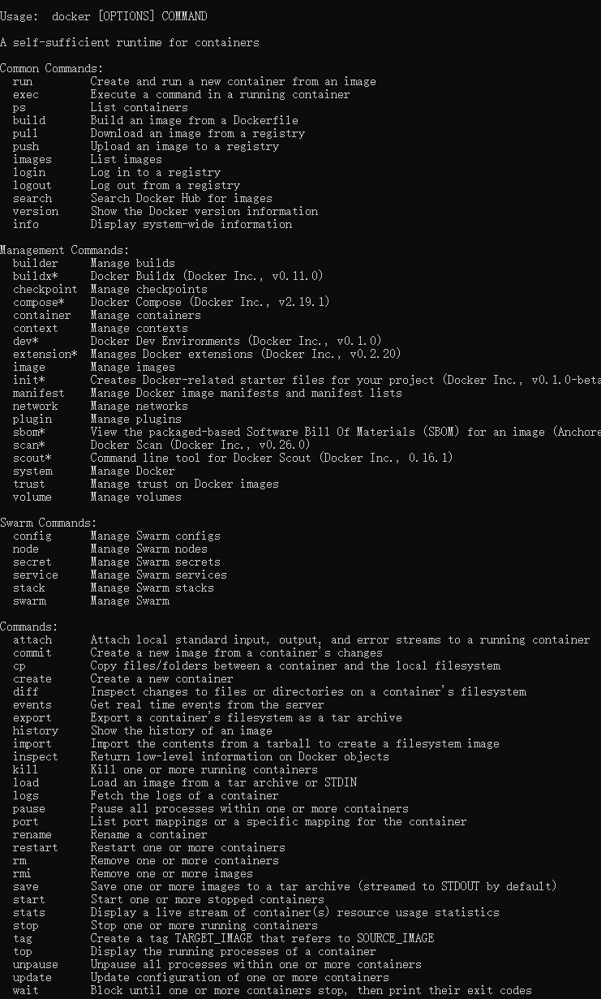

# 目录

# 一. Docker
## 1. 为什么需要Docker
背景：软件开发最大的麻烦事之一，就是环境配置。 用户必须保证两件事：操作系统的设置，各种库和组件的安装。只有它们都正确，软件才能运行。举例来说，安装一个 Python 应用，计算机必须有 Python 引擎，还必须有各种依赖，可能还要配置环境变量，环境配置如此麻烦，换一台机器，就要重来一次，引出了虚拟机，但是缺点很多，资源占用多，启动慢。 能不能有一个工具，让开发人员在任意环境下，都能安装软件，运行软件，而不需要考虑环境问题呢？

解决方法：Docker。


## 2. Docker 是什么？
Docker 是一个容器引擎，它允许你将你的应用程序封装到一个容器中，然后在任何地方运行。

基本概念：
- 容器化：Docker 利用了 Linux 内核的命名空间（Namespaces）、控制组（Control Groups, Cgroups）和联合文件系统（Union File System）等技术来实现容器的隔离和资源限制。•命名空间提供进程、网络、文件系统、用户ID、挂载点等层面的隔离，使得每个容器看起来就像拥有独立的系统资源。•控制组用来限制和审计各个容器对系统资源（如CPU、内存、磁盘IO、网络带宽等）的使用
- 镜像：Docker 镜像就是一个包含应用程序和其依赖的文件系统，可以被共享和重用。类似于java 中的class文件
- 容器：容器是运行时的一个实例，包含镜像中的文件系统和进程。类似于java中new的对象

## 3. 如何安装Docker

CentOS： `sudo yum install docker-ce docker-ce-cli containerd.io docker-compose-plugin`  


Windows: `下载 Docker Desktop Installer.exe`

```
docker  加速

{
"registry-mirrors": ["https://toubg30r.mirror.aliyuncs.com"]
}
```


## 4. Docker 的使用

### 4.1 docker 指令  


```shell
docker run -d --name my_nginx -p 80:80 -v D:\docker\nginx\conf.d:/etc/nginx/conf.d -v D:\docker\nginx\nginx.conf:/etc/nginx/nginx.conf -v D:\docker\nginx\html:/usr/share/nginx/html -v D:\docker\nginx\log:/var/log/nginx  nginx:latest
```
```shell
1. docker run 从镜像启动容器
     -d 后台运行
     -p 80:80 指定端口
     --name nginx 指定容器名
     -v <host path>:<container path> 指定挂载目录
     nginx 指定镜像
     -it /bin/bash 进入容器

2. docker ps 查看运行中的容器  -a 查看所有容器
3. docker exec -it <container id> /bin/bash 进入容器  -d 后台运行指令
4. docker images 查看镜像
5. docker search <image name> 搜索镜像
6. docker pull <image name> 拉取镜像
7. docker build -t <image name> . 从Dockerfile构建镜像

容器管理命令

1. docker stop <container id> 停止容器
2. dockker start <container id> 启动容器
3. docker restart <container id> 重启容器
4. docker rm <container id> 删除容器
5. docker kill <container id> 强制停止容器

镜像管理命令
1. docker commit <container id> <image name> 从容器中创建镜像
2. docker tag <image id> <image name> 为镜像打标签
3. docker rmi <image id> 删除镜像
4. docker push <image name> 推送镜像到仓库
5. docker export <container id> <path> 导出容器运行时的文件系统内容为镜像
6. docker import <path> <image name> 导入镜像
7. docker save <image name> 保存镜像  保存完整的镜像
docker save -o mysql-8.0.22.tar docker.io/mysql:8.0.22
```


### 4.1 Dockerfile文件构建镜像

```dockerfile
FROM openjdk:8-jre-alpine
MAINTAINER mxz
LABEL name="file-cabinet-api" version="1.0" author="mxz"
COPY ./target/file-cabinet-admin.jar file-cabinet-admin.jar
CMD ["java", "-jar", "file-cabinet-admin.jar"]

```


RUN 是会在构建镜像的时候执行，而 CMD 是在运行镜像的时候执行

CMD 和 ENTRYPOINT 区别：这两个指令都可以被用来在Docker容器启动时运行指定的命令，但它们的目标有所不同。"CMD"用于提供用于默认应用的默认值，这些默认值可以很容易地在运行时覆盖。而"ENTRYPOINT" 提供一个始终将在容器中执行的命令，这个命令的参数只能够被append进去，无法被覆盖, 也可以用来做准备工作，比如初始化数据库，生成文件等。

ARG 和 ENV 的区别 ， ARG 是在构建镜像的时候，ENV 是在运行镜像的时候，ARG 只能定义变量，不能赋值，只能在Dockerfile中使用，ENV 可以在Dockerfile中使用，也可以在运行镜像的时候使用

EXPOSE 暴露端口, 只不过是展示便于理解

``` docker buid -t file-cabinet-api```

### 4.2 Docker Compose 组合多个容器, 将命令用文件编排的方式储存起来

看下docker-compose 的指令


-f 指定使用的 Compose 模板文件，默认为 docker-compose.yml  
-p 项目名称，默认当前文件夹为项目名  

``` shell
docker compose 《-f  other.yml》 up -d 启动项目

docker compose pull && docker compose up -d  升级项目
```
指令会了， 学习写docker-compose.yml 文件

```yaml
version: '3'
services:
  file-cabinet-api:
    build: ./api
    image: chuangji/file-cabinet-api:latest
    container_name: file-cabinet-api
    ports:
      - "8080:8080"
    command: ['./wait-for-it.sh', 'mysql1:3306','-t','0','--', 'java', '-jar', 'file-cabinet-admin.jar']
    env_file:
      - .env
    depends_on:
      - redis
      - mysql1
      - emqx1
  mysql1:    #docker的容器名称,其他应用可以通过mysql_c通信这个容器
    image: mysql:5.7       #需要下载镜像 mysql
    container_name: mysql1
    ports:
      - "3306:3306"
    env_file:
      - .env
    environment:            #mysql的一些参数
      MYSQL_DATABASE: file_cabinet_dev           #mysql启动后会默认创建一个docker的database
      MYSQL_ROOT_PASSWORD: 123456         #root的密码
      MYSQL_USER: ${SQL_USER}
      MYSQL_PASSWORD: ${SQL_PWD}
      MYSQL_ROOT_HOST: '%'         #代表任何机器都可以连接当前数据库
    restart: always    #Docker容器重启时，当前容器也会自动重启。  
    volumes:
      - mysqldata:/var/lib/mysql
      - ./initsql:/docker-entrypoint-initdb.d
volumes:
  mysqldata:

```
```
docker-compose -f .\docker-compose-build.yml up -d
```

上传镜像
```shell
docker login --username=8363*****@qq.com registry.cn-hangzhou.aliyuncs.com

docker tag <imageId> registry.cn-hangzhou.aliyuncs.com/mxz1/<imageName>:<version>

docker push registry.cn-hangzhou.aliyuncs.com/mxz1/<imageName>:<version>


```

参考：
[docker官方使用说明](https://docs.docker.com/manuals/)


常见问题：
1. docekr desktop 无法启动  
解决：wsl --update
2. docker login 异常:panic: assignment to entry in nil map  
解决：docker logout ,然后再登录即可
