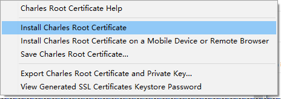
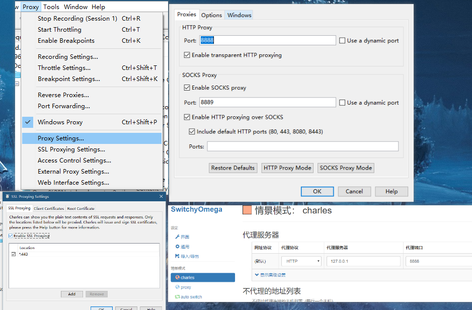
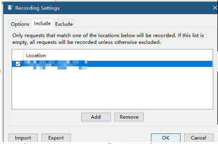

注册：

Registered Name: https://zhile.io
License Key: 48891cf209c6d32bf4

1. 下载安装证书到受信任机构  

2. 开启代理  

3. 电脑开启， 关闭防火墙
4. 手机代理也是统一局域网配置电脑ip及代理端口
   小米手机安装 Charles 证书
   手机连接 Charles 配置好的代理后，访问chls.pro/ssl安装证书，下载 charles-proxy-ssl-pro.pem，也可以直接push 到存储卡

（miui10及以上）点击设置-更多设置-系统安全-加密与凭据-从存储卡安装文件

（miui10一下）点击设置-更多设置-系统安全-从存储卡安装文件

点击安装即可，安装过程中需要输入手机密码。

过滤请求 (超级坑，忘了配置了这里结果所有请求都看不到了)  

设置断点修改请求和响应

Rewrite 重写

反向代理  访问本地8080会反向代理到百度

本地代理 localhost 不能访问
Localhost ： localhost.charlesproxy.com
