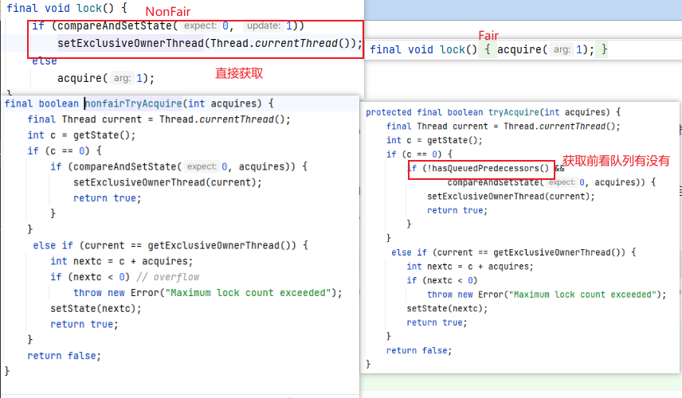

# 一. 概括
1. AbstractQueuedSynchronizer AQS 同步器, tryAcquire tryRelease 通过state来控制线程的获取锁和释放锁， 通过队列来管理线程的等待和唤醒
2. ReentrantLock 内部有一个AQS， 通过state来控制线程的获取锁和释放锁， 通过队列来管理线程的等待和唤醒, 同步器内部有两种AQS， 一种是公平锁， 一种是非公平锁， 默认不公平锁 非公平锁刚上来就直接去尝试获取锁， 公平锁在将要获取锁时判断队列上有其他的没， 有的话就排队， 没有的话就直接获取锁， 而且他还是个重入锁，lock 几层unlock几层
3. Condition 相当于唤醒器， 有 await 和 signal， await 当前线程会加入到当前condition的队列上，并且释放锁(所以await 要包裹在lock中),中断, signal 会唤醒头节点， 唤醒后相当于再次去抢占锁，抢占不到加到队列上
4. CountDownLatch  门闩内部sync, await会加到队列上休眠, countDown 一次都会减1，但不会停止。 直到为0时 唤醒队列上的await线程节点
5. CyclicBarrier  初始化可以设定唤醒条件count, 也可以设定唤醒的线程任务， 会await 阻塞， 达到数量后全部放行 内部有个condition 来进行await 为0时会全部唤醒
6. Semaphore  信号量， 有一个计数器， 通过acquire 和 release 来控制计数器， 当计数器为0时，acquire会阻塞加到队列上， release唤醒的时候，会加1
7. ReentrantReadWriteLock  读写锁， 读锁可以多个线程同时获取， 写锁只能一个线程获取， 读锁和写锁不能同时获取

# 二. 

## 1. ReentrantLock  
 内部两种不同的同步器  


tryLock   指定中断时间，到点醒来后，仍获取不到锁就从队列上移除自己

## 2. Condition

```java
        public final void await() throws InterruptedException {
            if (Thread.interrupted())
                throw new InterruptedException();
            // 加到conditon的队列上
            Node node = addConditionWaiter();
            // 唤醒当前锁上的其他线程
            int savedState = fullyRelease(node);
            int interruptMode = 0;
            // 判断当前线程是否在队列上， 不在的话就park
            while (!isOnSyncQueue(node)) {
                LockSupport.park(this);
                if ((interruptMode = checkInterruptWhileWaiting(node)) != 0)
                    break;
            }
            // 被唤醒后， 重新获取锁， 不是头节点， 加到队列上进行睡眠
            if (acquireQueued(node, savedState) && interruptMode != THROW_IE)
                interruptMode = REINTERRUPT;
            if (node.nextWaiter != null) // clean up if cancelled
                unlinkCancelledWaiters();
            if (interruptMode != 0)
                reportInterruptAfterWait(interruptMode);
        }

        // 唤醒 流程
        final boolean transferForSignal(Node node) {
            if (!compareAndSetWaitStatus(node, Node.CONDITION, 0))
            return false;
    
            Node p = enq(node);
            int ws = p.waitStatus;
            if (ws > 0 || !compareAndSetWaitStatus(p, ws, Node.SIGNAL))
            LockSupport.unpark(node.thread);
            return true;
        }
```
3. CountDownLatch 和 CyclicBarrier 的区别 
   1. CyclicBarrier的某个线程运行到某个点上之后，该线程即停止运行，直到所有的线程都到达了这个点，所有线程才重新运行；CountDownLatch则不是，某线程运行到某个点上之后，只是给某个数值-1而已，该线程继续运行
   2. CyclicBarrier只能唤起一个任务，CountDownLatch可以唤起多个任务
   3. CyclicBarrier可重用，CountDownLatch不可重用，计数值为0该CountDownLatch就不可再用了
   4. CyclicBarrier  await 会加锁， CountDownLatch await 不会加锁, 全是cas操作 ，而且内部时同步期Sync 所以不能重置，重置的话，其他线程执行

4. Semaphore 和 ReentrantLock  区别
   1. 锁可重入, 信号量重入可能会造成死锁， 没法释放
   2. 死锁恢复， 信号量在任意线程都可release， 锁只能持有者才能释放

