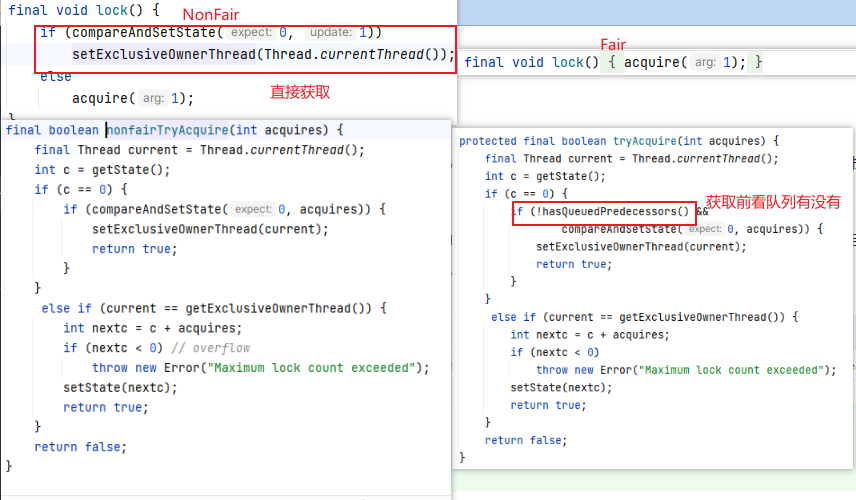

# 一. 概括
1. AbstractQueuedSynchronizer AQS 同步器, tryAcquire tryRelease 通过state来控制线程的获取锁和释放锁， 通过队列来管理线程的等待和唤醒
2. ReentrantLock 内部有一个AQS， 通过state来控制线程的获取锁和释放锁， 通过队列来管理线程的等待和唤醒, 同步器内部有两种AQS， 一种是公平锁， 一种是非公平锁， 默认不公平锁 非公平锁刚上来就直接去尝试获取锁， 公平锁在将要获取锁时判断队列上有其他的没， 有的话就排队， 没有的话就直接获取锁， 而且他还是个重入锁，lock 几层unlock几层，
3. Condition 相当于唤醒器， 有 await 和 signal， await 当前线程会加入到当前condition的队列上，并且释放锁(所以await 要包裹在lock中),中断, signal 会唤醒头节点， 唤醒后相当于再次去抢占锁，抢占不到加到队列上
4. 

# 二. 

## 1. ReentrantLock  
 内部两种不同的同步器  

tryLock   指定中断时间，到点醒来后，仍获取不到锁就从队列上移除自己

## 2. Condition

