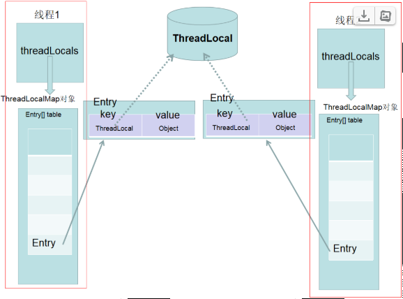

# 一. 概括
ThreadLocal  用一句话解释就是 Thread 的每个线程上都有一个Map, 键是ThreadLocal 对象，值是我们set的值。


# 二. 


```java
    public T get() {
        Thread t = Thread.currentThread();
        ThreadLocalMap map = getMap(t);
        if (map != null) {
            ThreadLocalMap.Entry e = map.getEntry(this);
            if (e != null) {
                @SuppressWarnings("unchecked")
                T result = (T)e.value;
                return result;
            }
        }
        return setInitialValue();
    }
```
内部Entry key 为弱引用， 不在使用的时候，如果不是弱引用， 在其他线程仍在运行过程中， 键值引用了他， 可能内存永远不会释放， 设置为null后， 线程在再次localmap使用的时候会clean 键值为null的Entry， 所以最好调一下remove

用法：
Spring的事务管理，用ThreadLocal存储Connection，从而各个DAO可以获取同一Connection，可以进行事务回滚，提交等操作。


