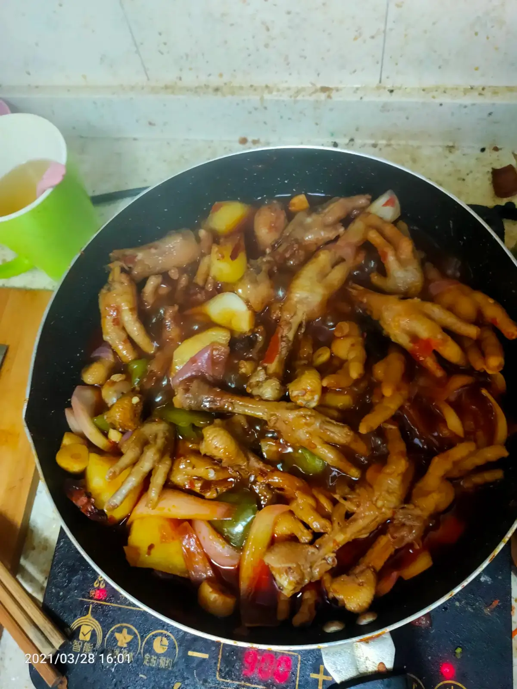

昨天晚上想了一晚上上周吃的肉蟹煲，早上直接每日优鲜下单，买了鸡爪
以前一直不喜欢吃鸡爪，总感觉很恐怖（小时候妈妈杀完鸡，我爸老是拿着鸡爪抓着它的筋，鸡爪一张一张的吓我），肉还很少，泡椒凤爪什么的也一概不吃
，最近吃过好，发现真的确实是种美味

下午四点开做，

1. 鸡爪指甲剪干净
2. 鸡爪稍微和大料煮一下，撇去覆膜
3. 切洋葱蒜姜， 在锅里炒下，放入两大勺豆瓣酱，然后炒香
4. 生抽酱油，鸡爪怼进去， 加热水，放点冰糖桂皮
   5,. 熬煮一会儿后加入土豆洋葱等

做好后还没想吃一阵锻炼

想起当初刚来深圳在王小雷那里真是壮实

