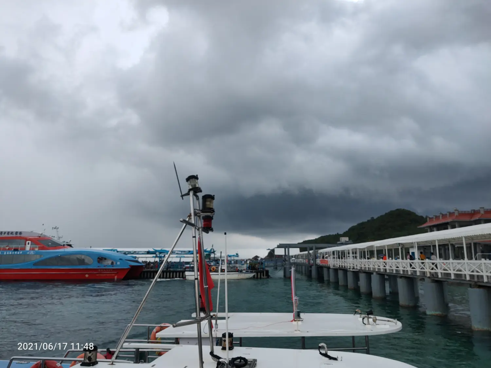

今天早早就起来了，7点50就要到车站上车
7点15墨迹到40出门退房存行李，
到了海边公交站，我们是第一站，经过一个半小时，导游在车上说岛上套餐。最后我俩选了皮艇套餐220

坐船15分钟到了岛上，下起了大暴雨

找个厕所，墨迹墨迹到海边，终于雨停了回来坐皮艇，坐了一圈绕岛真的没啥看的。瞌睡

回来又在海边溜达，拿出手机录制视频。录制背起他，抗

下午4点50就返程了，回去路过摊子吃了香水菠萝和一份面。坐大巴回去，到酒店还早又在海边溜达了一会儿
打的去机场，到机场整理行李，把能喝的喝完，三瓶红牛。三瓶矿泉水

进了机场里面，去免税店取货

又逛了会儿免税店，买了洁面霜，回家，到家已经1点半了，深圳这边外面还有烧烤摊在营业
