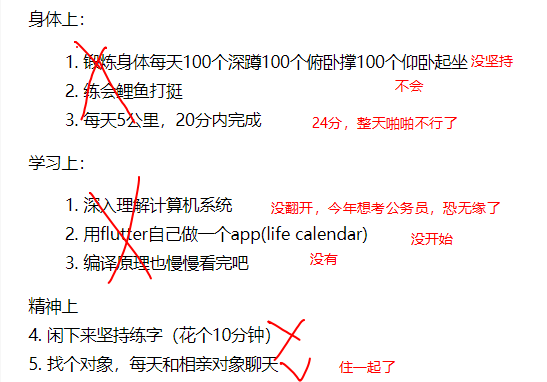

2020 是一个神奇的一年
过年疫情爆发，只能呆在家里，而在家里的我也在准备来年的面试，同时也准备在家里的相亲
2 月初来到深圳，线上面试， 3月20号， 辞去了来深圳呆的第一家公司11k， 前往下一个15k，12月初被辞退，n+1， 本来打算好好准备公务员考试， 可一个面试接着一个面试。 需要坐地铁的我都不想去。附近的壹方城VIvo， 20号入职。 中间休息了接近两周， 和过年的相亲对象， 也是现在的女朋友去东西冲玩了，又去海雅缤纷城划冰。 开开心心的两个周末。
今年没有什么学习上的进展，在上家公司一直重构代码，只是对mq有了深入的了解，自己写的文档也要慢慢整理到博客上，因为现在的这家不能外部传输文件

总结一下去年的目标：

看了一遍真惭愧

算了聊胜于无，总算完成一件，，带着跑了一个月就一分钟想出好几个理由

2021
身体上

1. 跑步20分钟5公里， 每天120个俯卧撑， 100 个仰卧起坐， 200个蹲起（太花时间可以单腿）
2. 劈叉，引体向上10

   学习上 1. 过年前把公务员视频看完， 能成功上岸最好 2. 干好这份工作 3. 学习底层原理及硬件方面知识
   感情上 1. 订婚， 可以的话10.1结婚。 按着我的节奏来

愿2022 年 我能在上面这几条多打几个对勾，重回当年

算了，一个人也是一支队伍。同学回家了，一个人在他这儿取暖吃牛肉干
