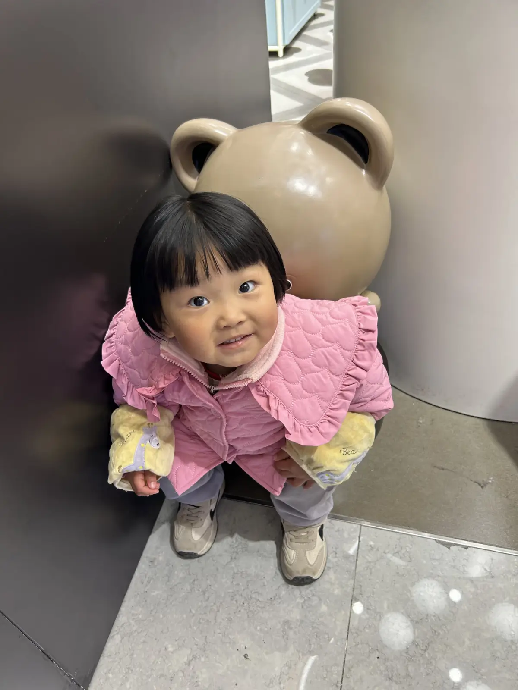

最近一年和去年相比胖了整整30斤， 虽然整个人脸充盈起来了，头发也多起来了， 但是血压也高了起来， 上半年去教资体检， 结果血压高，一番周折才通过。  
22号，下午脑袋发热浑身不舒服，终于是呆不下去了， 请了假。本来准备走了，领导说这样就算不上半天工资了，因为我提请假时已经是下午4点半了，再过俩小时就下班了。 我当时也是挺纠结的，之前我们有个产品就是宁肯自己发烧也要撑到中午，这我是做不到的，不就是100多块钱嘛，最后领导说是再呆一个小时可以早点走，于是打算忍忍，看能熬过去不， 其实当时我出来精神头已经好多了，出门还给公司的小狗和他的孩子们拍张照呢，于是回去待到了5点，熬不下去，骑车回家，浑身发冷。在河堤上吧中午吃的大碗辣椒烩面吐了出来。  
回到村里已经五点半了，村医出看病，体温38.6，开了退烧药其他药。病毒性感染。回来就喝了退烧药，躺在床上等退烧。  
  
奈何体温不降反增，逐渐达到39.8。 持续不下， 这时已经过了一个小时了， 范也要出去了，让他问了村医，村医说再等等，等四个小时不行就再吃。 想起去年五月份兰汐在医院也是高烧不退，那是我是特别的担忧，现在我也是怕我烧死，但我精神还是挺好的，还想听个明朝那些事。  
熬呀熬， 熬到了8点半，体温终于降到了37.8， 持续不下， 不过整个人已经不抖了， 去洗了个澡，整个人都是蒙蒙的，耳鸣， 躺在床上到半夜都睡不着。 睡前喝了医生推荐的奥司他韦（真tm贵，我怀疑病毒的来源了，疫情时候真是一药难求）。 半夜一阵狂吐，早上睡醒已经好多了。  
  
到今天身体已经恢复了。  
  
周六带着孩子取了奶粉，买了糖葫芦，看了打铁花  
  
  
周日，去关林市场买衣服，买石膏画（昨天路边画要25）今天买的才23。 回来吃过午饭，4点兰汐不睡觉于是带着她去泉舜抓娃娃，到了桥上，她就看着动画片睡着了。我说咱回家吧，兰汐梦中要抓娃娃。到了地方停好车，把兰汐叫醒，到商场大玩一场。  
中间我急着上厕所，又没有家庭厕所，男厕的蹲坑都被占着，只能快速的让宝贝站在厕所门口，让她拿着我的手机，千万不敢乱动，兰溪连连点头，果然出来老老实实呆着，太乖了。  
  
  
29.9 100 个币，是挺便宜的，但是被吞掉的也不少，只能去抓小车，这个抓了10来个， 最后我又通过甩抓抓了两包运康锅巴。   
  
还有兰汐每次见到娃娃都要合照，这个撅嘴的老爱合照了，宛若他的好朋友  
  
  
  
  
