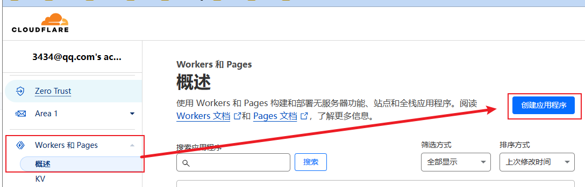
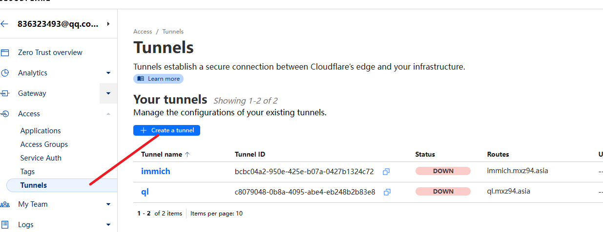
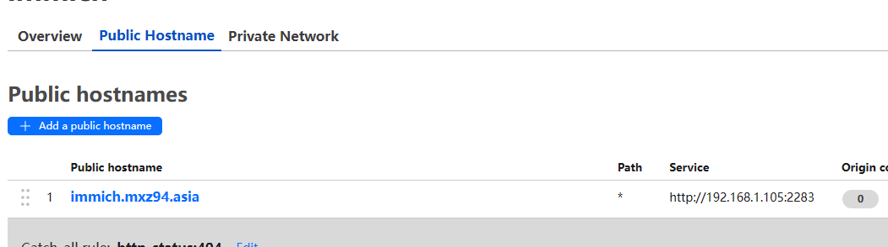
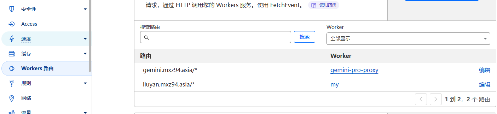

cloudflare 大善人 先夸奖一下

# 一. 部署静态页面

1. 选择页面  

2. 连接仓库， 选择部署框架


# 二. 内网穿透
准备：有一个域名 这里我申请了一个域名 malanxi.top  一年6元， 明年再看看要不要永久把  
1. 在首页， 左侧网站 添加站点
2. 将cloudflare 生成的dns 填写到域名服务商修改为cloudflare 的dns
3. 添加tuunels 隧道  


选择docker 部署connector
```docker
docker run -d --name=immich_cl cloudflare/cloudflared:latest tunnel --no-autoupdate run --token eyJhIjoiNTI2NjZmODNlZjdkZWM3ZTFmMzNiYzBdhZmM5MWM2OTMiLCJ0IjoiYmNiYzA0YTItOTUwZS00MjVlLWIwN2EtMDQyN2IxMzI0YzcyIiwicyI6Ik9UTTVZakF5WkRRdFl6WTJPUzAwTmpWaUxXSTVNbVF0TlRFM1pqRmpOVGhqWldaaSJ9
```

注： 这里要填局域网ip 127.0.0.1 不行


部署完返回查看是否状态正常， 有一定延迟

如果后续需要修改， 要记得去 worker 路由出删除路由

# 三. 部署worker

受环境影响， worker 部署可能访问不到， 所以可以利用域名添加路由的方式访问worker



