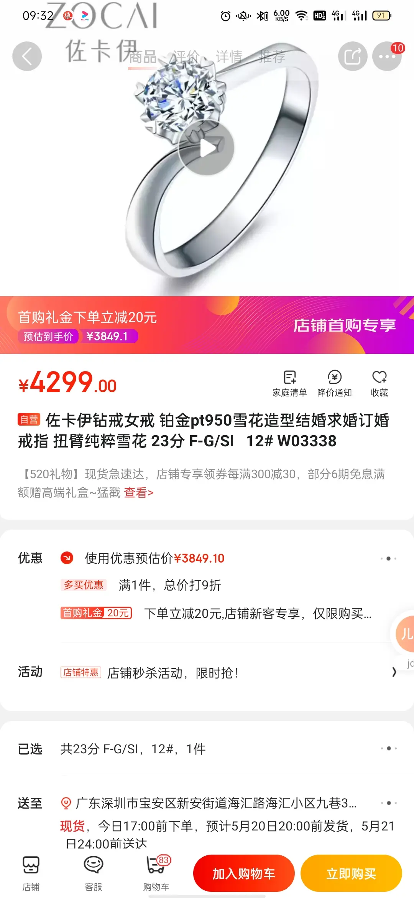

今天周一，范休息，本来我也想早点走，结果联调东西到8点，然后8点多去益田假日买戒指，下班，她穿了去年五一去海边玩的纱纱群，就那个轻轻的，去年五一来找你的时候，去海边穿的那个。 还挺好看的，就是有点壮， 

然后让他去顺电白嫖人家体重秤，92斤， 慢慢减肥吧

见到说，去称体重跟做贼似的，不是买不起称，是买了就天天称了

去那边商场不远，到了就8点40

逛了周大福，22分的 6000多
然后去了佐卡伊，之前在京东看了佐卡伊的戒指，知道大概价格，没想到店里比京东上还便宜200， 于是就定了

去之前还以为我的钱不够，15号我的钱刚发工资就存起来了，溜了房租、、

回来路边吃了炸串，没酱

我妈在群里发拼多多的链接，不想说是骗人的，哎给我妈发个红包吧
