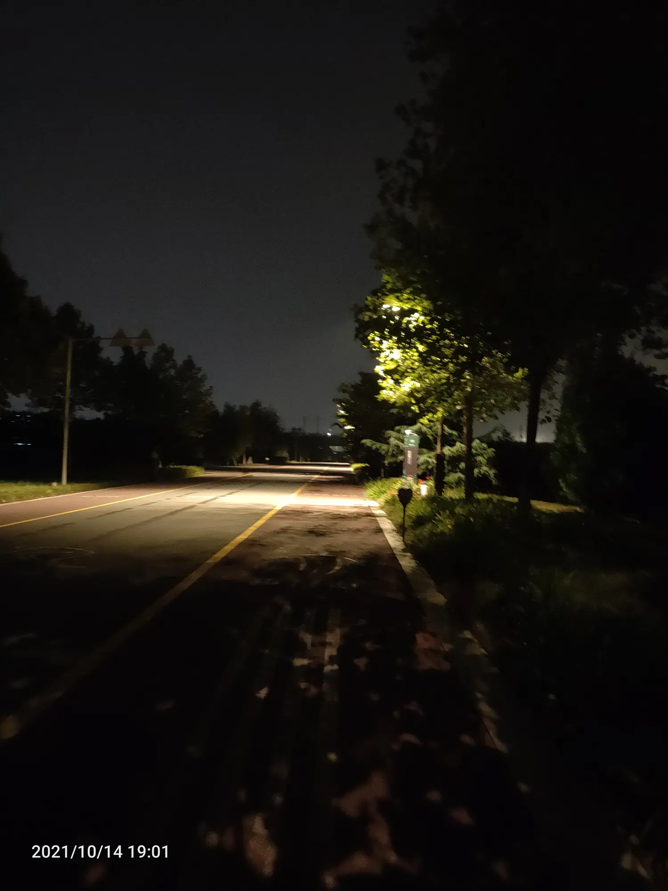

今天上班第二天，早上就早早起来7点，洗脸刷牙，昨天难过入睡。
 早上天有点阴，心情也有点不舒服。做在屋里等八点，吃了鸡蛋炒饼，吃了汤出门。
中午吃了一碗糊涂面条。晚上下班本想去开元湖跑步，最后还是去大雁上吧。回来时刚昂7点多

回家，爸妈去看结婚日，我和小侄子在家，烦着我要看小度，最后哄着他找玩具玩，找到了去年端午回来拿的泡泡机，没有水和电，找到电池和洗衣粉水，不能玩。

回来我爸说元旦结婚。心里不知道怎么就是不想结婚，不想和她结婚，不想结婚

不想结婚，不想结婚，后悔当初
