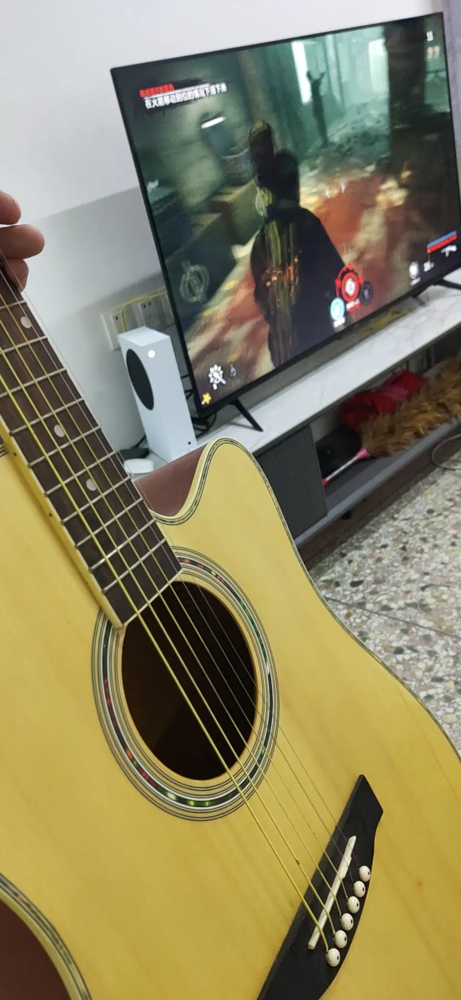
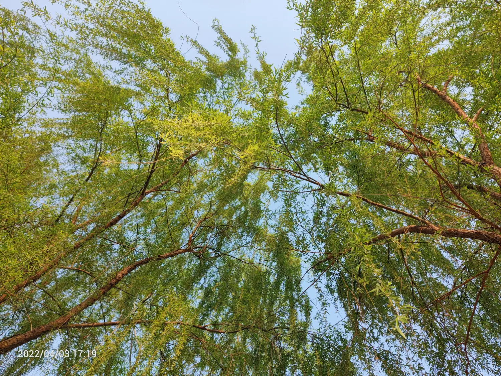
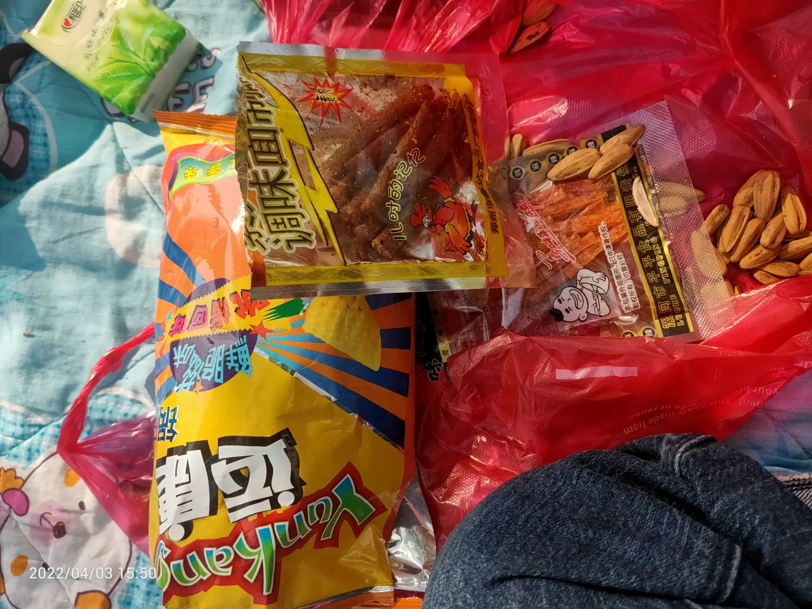
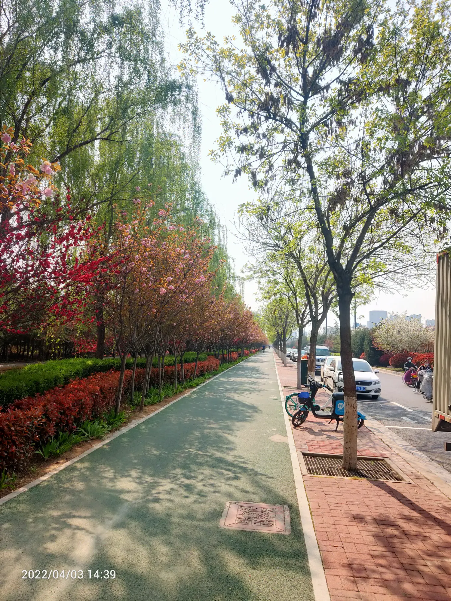

这两天天气都特别的好，而且是周末，上午睡到自然醒，中午吃过饭，拿着床单，吊床， 音响，小枕头， 开着车先去五号小区买了点草莓， 然后菠萝太贵了， 去关林买了点香蕉， 在河滩这边呆了一下午

第二天，早上去奶奶家，想着带着奶奶出去转转，老人不喜欢出去，智能叫上弟弟去。 去龙门石窟，只有我俩有年票，就进不去了

去大张买了西瓜芒果水，  去河滩呆到下午4点回家

然后我妈让我给地调两单水， 肩膀被压了两道红印

5号，下午送他回去，去关林市场买了东西，然后去全顺逛， 因为我说他人家一个烧烤的工资都比你高，就生气，不高兴，各自回家吧
