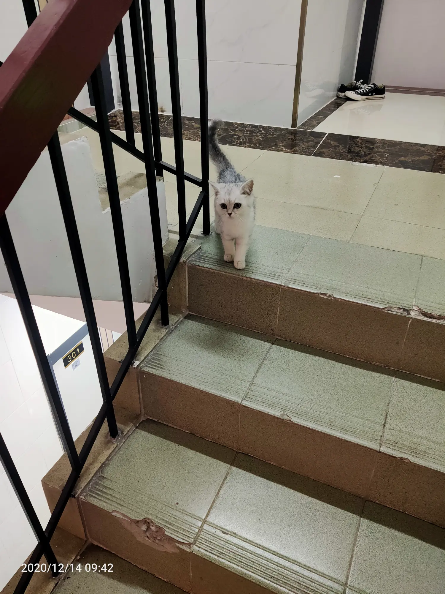

今天没事干，心情也因为之前不高兴

本来说爬山然后太冷没去

本来准备早上打羽毛球

碰到了一只小猫，多嘴问了下
然后没打几个帮人家看猫了

然后出门

去了海雅缤纷城

吃了酸菜鱼 阿范付账

滑冰我付账

滑冰挺开心的

晚上和阿范说了我为什么不高兴，然后确实是我想太多了，它也莫名感到委屈，哭的想吐，真的我一点不高兴它都能感觉的到。三天没事还一直问我有什么事一定要跟它说，哎，是我想的太多了，很简单的东西

然后终于都不生气了。我说要不回家给你爷爷过寿吧，她超级开心，
