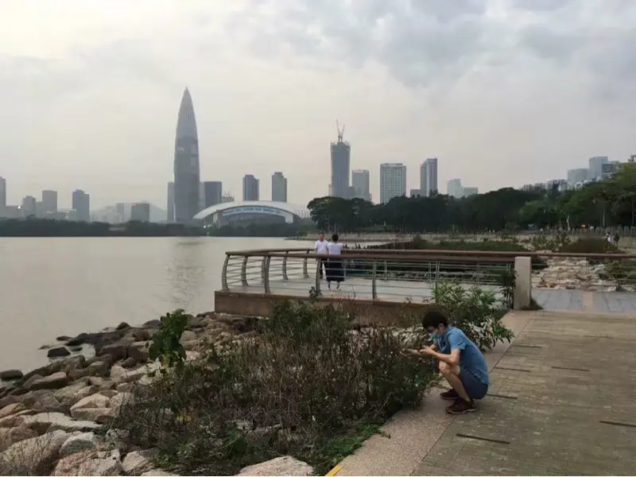
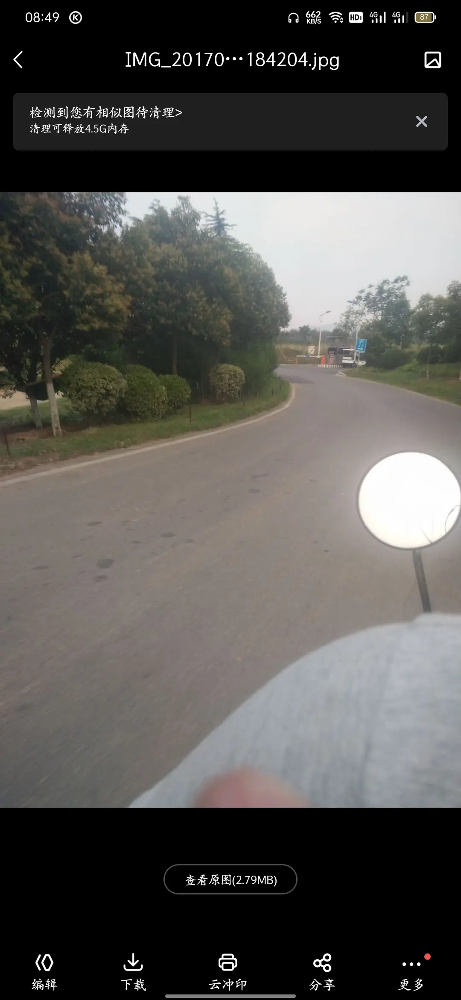
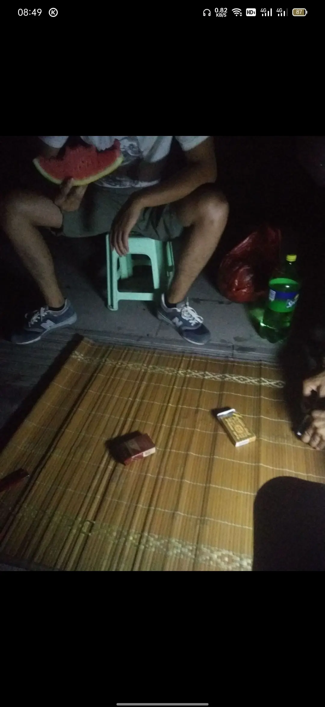

这个夏天马上过去，今天也是离开深圳的第20天

治超发了张19年在深圳湾玩拍的照片

我和治超认识的时间挺长的
12年下半年去到普通班，旭旭说治超跟她玩的特别好，于是我们也玩的好。想象毕业那年经常和阿旭第四节跑出去吃饭，和四方一个眼神招呼去星座包夜。
一句话和治超去外面喝酒。喝的最爽的一次就是13年6月，临近结束，去地调队要了一碗凉皮，1件啤酒，喝完去，关林庙，然后去网吧吐了一键盘。

回来晚上叫着去包夜，跑到别的班睡觉

认识这么久，在深圳我俩各自有了自己的生活。有时候真的互相爱发小脾气。现在想想真的治超和我对象比这，我真的感觉还是兄弟好。因为我俩互相喊对方来自己家，都是很快，很高兴。而她却是

希望治超攒够钱就回来，我是先离开了

这个夏天没有治超的陪玩，少了很多快乐时光

